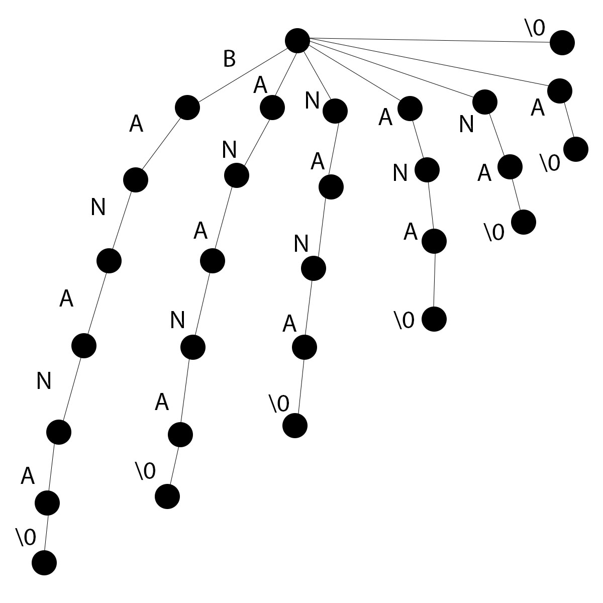
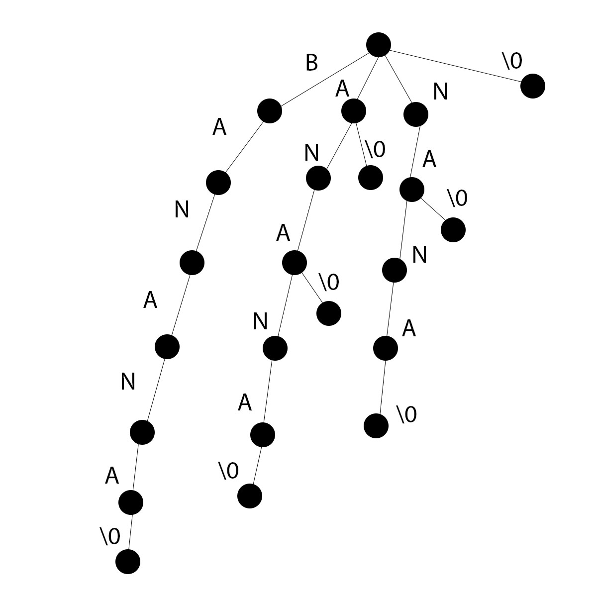
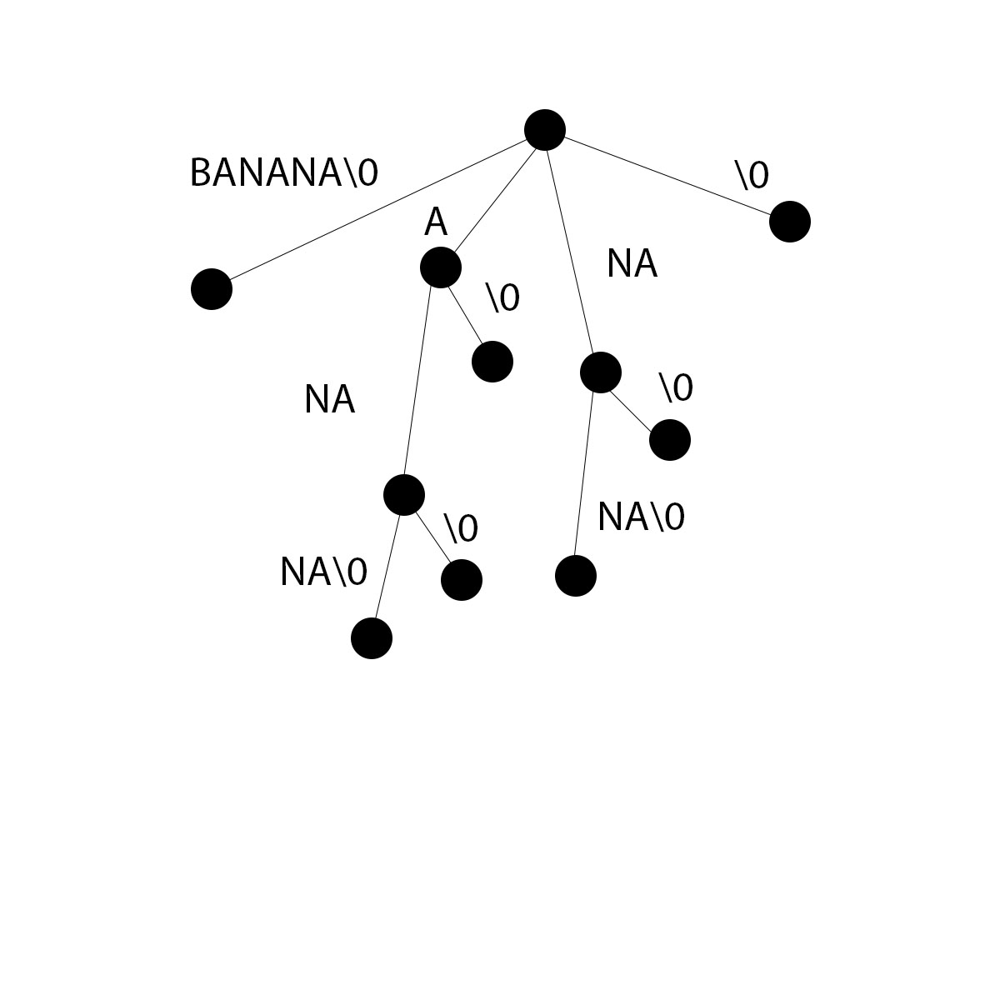

# Suffix Tree

## I. OVERVIEW

A "*trie*" is a tree-like data structure whose nodes store the letters of an alphabet. A ***Suffix Tree*** is simply a *compressed trie* for all suffixes of a given text, and is extremely useful in searching for patterns. It is a space-efficient data structure to store strings
that allows many kinds of queries to be answered quickly.

This repository includes a Javascript implementation/demo of a *Generalized Suffix Tree*. The demo can also be found at: https://projects.aziztitu.com/sau/ai/suffix-tree-demo/

## II. HOW DOES IT WORK?
A Suffix Tree works by storing all the suffixes of the word(s) in a tree like structure.

For example, the suffixes of the word "Banana" are:
- Banana
- anana
- nana
- ana
- na
- a

Now, the suffixes with common prefixes can be combined:
- "***ana***na" and "***ana***"
- "***na***na" and "***na***"
- "***a***nana" and "***a***"

 

After combining the suffixes, they look something like this:

<table>
<tr>
<th>Before Combining (A Regular Tree):</th>
<th>After Combining (A Standard Trie):</th>
</tr>
<tr>
<td></td>
<td>
</td>
</tr>
</table>

 

The next and final step is to reduce the number of unnecessary edges by compressing the nodes. This is done by joining chains of single nodes together, and representing them as one node. It looks something like this:

**After Compressing (A Suffix Tree):**

Constructing the Suffix Tree in code can get very complex, and a *naive* implementation for generating a suffix tree would have O(n2) or even O(n3) time complexity.

But using [Ukkonen's algorithm](https://www.cs.helsinki.fi/u/ukkonen/SuffixT1withFigs.pdf), the entire suffix tree can be built on-line (on-the-fly) in O(n) time complexity where n is the length of the text to be preprocessed.

### Pattern Searching:

Now that the suffix tree is built by preprocessing the text, we can search for any pattern in O(m) time complexity where m is the length of the pattern.

To search for a pattern on the suffix tree:
1. Starting from the root node, do the following:
      - If there is an edge from the current node leading to the current character in the pattern,
        - Follow that edge to get to the next node
        - Move to the next character in the pattern.
      - If not,
        - The pattern does not exist in the text.
2. If all the characters in the pattern have been processed, the pattern is found.

 

### Generalized Suffix Tree:

A Generalized Suffix tree is a variation on the regular suffix tree in which suffixes for multiple strings can be stored.

This project includes an implementation of a Generalized Suffix tree that uses Ukkonen's algorithm.

For more information on Generalized Suffix Tree, take a look at: https://www.geeksforgeeks.org/generalized-suffix-tree-1/

## III. HOW IS THIS DATA STRUCTURE USEFUL?

Some of the applications of suffix trees include:
- Searching for large sequences of genomes
- Text auto-completion
- Finding longest repeating substring
- Finding the longest common substring
- Finding the longest palindrome in a string

There are other approaches to some of these applications, but Suffix trees are an ideal fit as they have a linear time complexity for "on-line" construction as well as for searching.

Other approaches include algorithms such as [KMP](https://www.geeksforgeeks.org/kmp-algorithm-for-pattern-searching/), and [Boyer-Moore](https://www.geeksforgeeks.org/boyer-moore-algorithm-for-pattern-searching/) that preprocess the *pattern* to make *the* pattern searching better, whereas the Suffix Tree preprocesses the *text* to make *any* pattern searching better.

Also since Suffix Tree is more general, you can perform a wide variety of queries on it. The downside however is that it uses more disk space and takes a little longer to preprocess the text.

## IV. FURTHER READING

"On-line Contruction of suffix trees" by Esko Ukkonen: https://www.cs.helsinki.fi/u/ukkonen/SuffixT1withFigs.pdf

Ukkonen's Algorithm in plain english: https://stackoverflow.com/questions/9452701/ukkonens-suffix-tree-algorithm-in-plain-english

Suffix tree and it's construction with some psuedo code: http://www.allisons.org/ll/AlgDS/Tree/Suffix/

Pattern searching using Suffix Trees: https://www.geeksforgeeks.org/pattern-searching-using-suffix-tree/

Ukkonen's algorithm for Generalized Suffix Trees: https://stackoverflow.com/questions/28278802/ukkonens-algorithm-for-generalized-suffix-trees

See also:

- Trie: https://www.geeksforgeeks.org/trie-insert-and-search/

- Generalized Suffix Trees: https://www.geeksforgeeks.org/generalized-suffix-tree-1/

- KMP: https://www.geeksforgeeks.org/kmp-algorithm-for-pattern-searching/
- Boyer-Moore: https://www.geeksforgeeks.org/boyer-moore-algorithm-for-pattern-searching/

